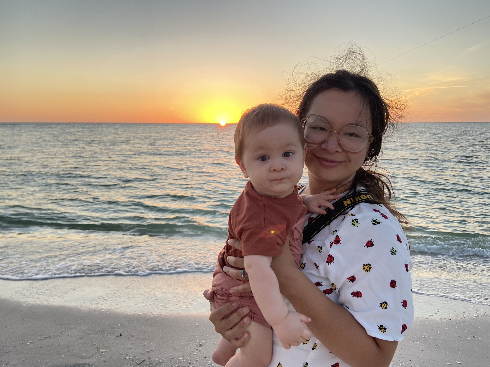

---
hide:
  - footer
  - toc
  - navigation
---

# **About Me**

Hello! My name is Cathleen Lapadat and I am a photographer based in Boynton Beach, Florida. I am a mother of a little toddler named Charlie with a baby girl on the way. I have spent several years photographing wildlife and nature as a hobby. As a recent stay-at-home mom, I have realized how important it is to photograph memories of Charlie throughout his development and growth. I find unbridled joy in doing so and relentlessly revisit these memories through my photos. My goal is to provide the same sentiment for other families while capturing people in their most authentic and vulnerable selves. My focus is on candid family portraits but I am open to photographing weddings and events.

Please contact me directly via email for session options and details.

{: style="height:100%;width:100%"}

 

Charlie and Wolfie Photography is available throughout South Florida.

<a href = "mailto: abc@example.com">Email: charlieandwolfiephotography@gmail.com</a>

