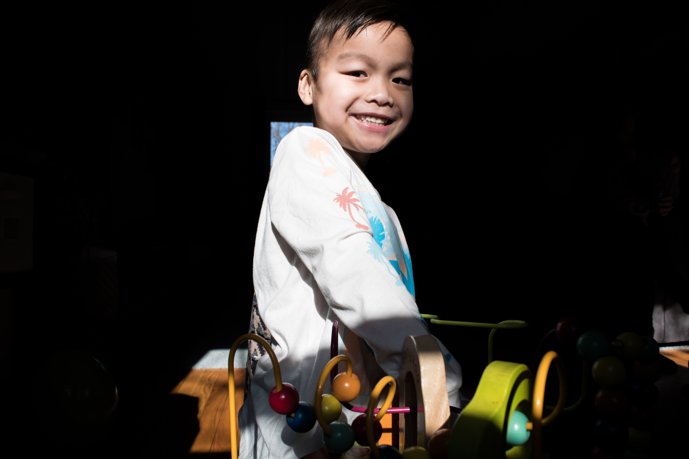
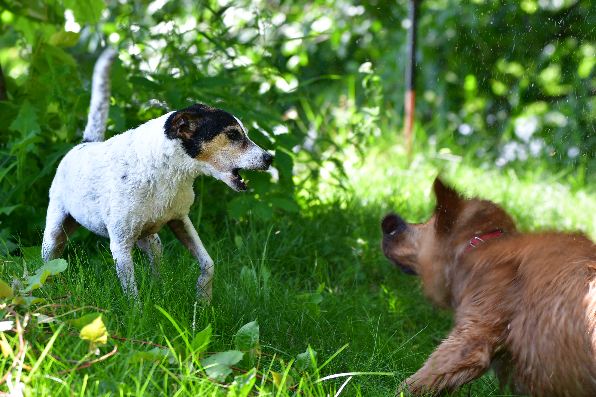
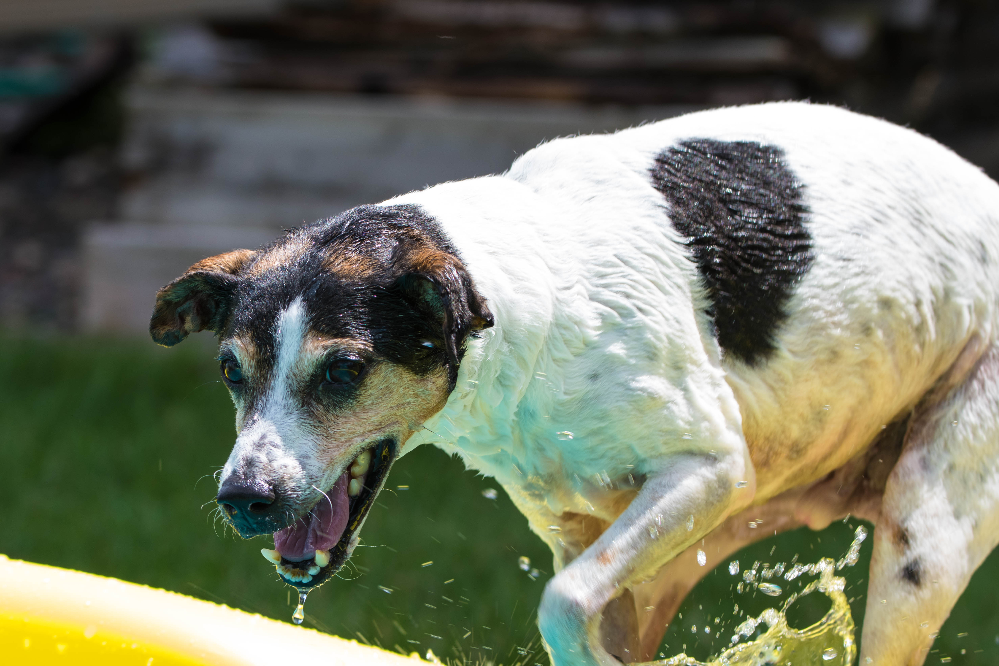

---
hide:
  - toc
  - footer
---

#**Portfolio**

||||
|-|-|-|
||||
||||
||||

ffmpeg \
-framerate 10 -loop 1 -t 5 -i 1.png \
-framerate 10 -loop 1 -t 5 -i 2.png \
-framerate 10 -loop 1 -t 5 -i 3.png \
-framerate 10 -loop 1 -t 5 -i 4.png \
-framerate 10 -loop 1 -t 5 -i 5.png \
-filter_complex \
"[1]format=rgba,fade=d=1:t=in:alpha=1,setpts=PTS-STARTPTS+4/TB[f0]; \
 [2]format=rgba,fade=d=1:t=in:alpha=1,setpts=PTS-STARTPTS+8/TB[f1]; \
 [3]format=rgba,fade=d=1:t=in:alpha=1,setpts=PTS-STARTPTS+12/TB[f2]; \
 [4]format=rgba,fade=d=1:t=in:alpha=1,setpts=PTS-STARTPTS+16/TB[f3]; \
 [0][f0]overlay[bg1];[bg1][f1]overlay[bg2];[bg2][f2]overlay[bg3];[bg3][f3]overlay,split[v0][v1]; \
 [v0]palettegen[p];[v1][p]paletteuse[v]" -map "[v]" out.gif
 
 ffmpeg \
-loop 1 -t 5 -i 1.png \
-loop 1 -t 5 -i 2.png \
-loop 1 -t 5 -i 3.png \
-loop 1 -t 5 -i 4.png \
-loop 1 -t 5 -i 5.png \
-filter_complex \
"[1]format=yuva444p,fade=d=1:t=in:alpha=1,setpts=PTS-STARTPTS+4/TB[f0]; \
 [2]format=yuva444p,fade=d=1:t=in:alpha=1,setpts=PTS-STARTPTS+8/TB[f1]; \
 [3]format=yuva444p,fade=d=1:t=in:alpha=1,setpts=PTS-STARTPTS+12/TB[f2]; \
 [4]format=yuva444p,fade=d=1:t=in:alpha=1,setpts=PTS-STARTPTS+16/TB[f3]; \
 [0][f0]overlay[bg1];[bg1][f1]overlay[bg2];[bg2][f2]overlay[bg3]; \
 [bg3][f3]overlay,format=yuv420p[v]" -map "[v]" -movflags +faststart out.mp4